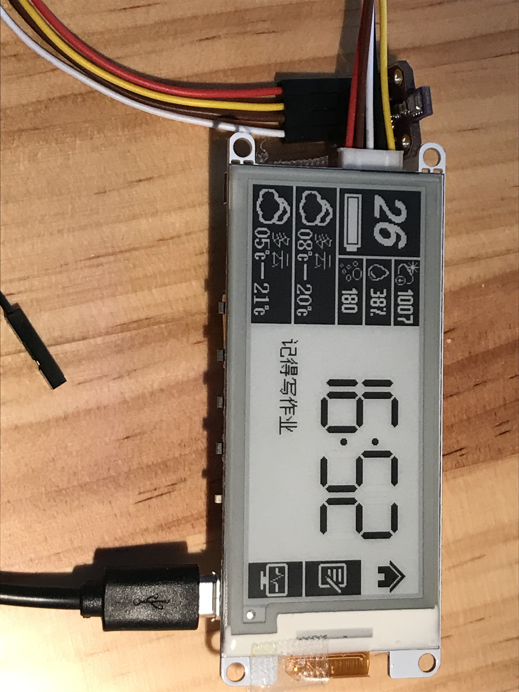
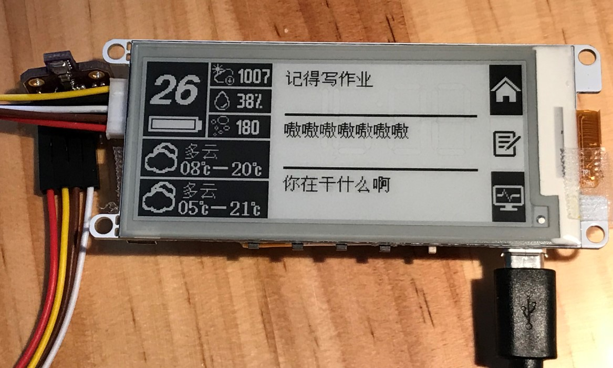
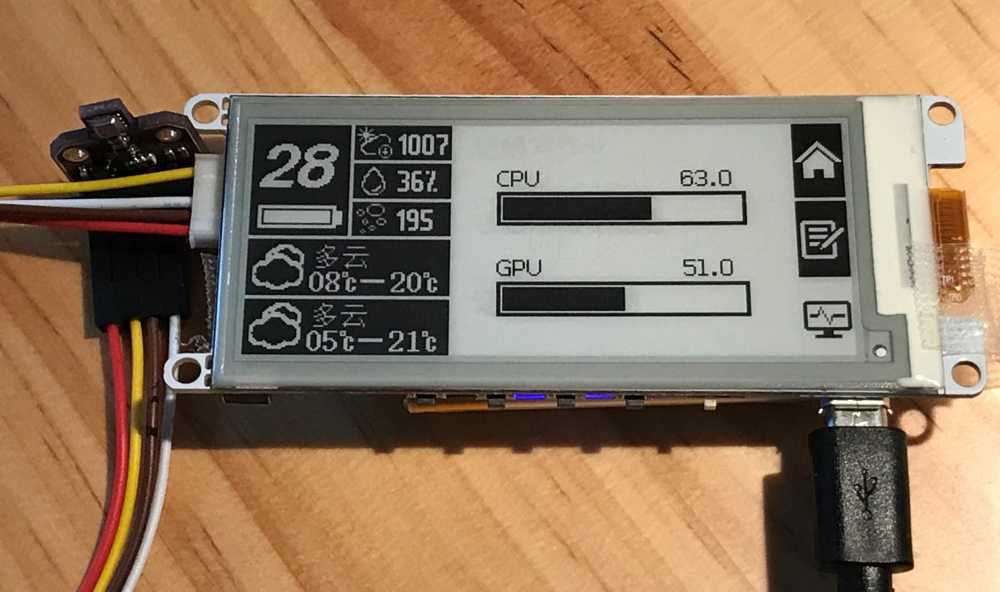

# E-ink-esp32-arduino-weather-time-note
You can get time\weather\temperature-inside\humility-inside\pressure-inside\IAQ-inside\QQ-note\computer-info on this device.

[Video Introduction](https://www.bilibili.com/video/BV1pt4y1y7ya)

  

   

  

# ENGLISH:

支持TTGO T5 V2.2 和 TTGO T5 V2.3两个型号的开发板，其他型号未适配。

## BEFORE：

1.prepare the online weather API（https://dev.heweather.com/ ）

## SERVER：

1.prepare a vps, suck as Windows server.

2.config MQTT server on your vps.

3.install [CQT](https://www.bilibili.com/video/BV13E4113777/)IMPORTANT! CQT is not working any more. please use HTTP API.

4.install CQhttp plugin（https://cqp.cc/t/30748 ）

5.modify .py. add your QQ number in the right place.

6.install python requirements.

## Arduino：

1.install Arduino IDE.

2.install esp32-arduino board for Arduino IDE（https://raw.githubusercontent.com/espressif/arduino-esp32/gh-pages/package_esp32_index.json ）

3.install Arduino library
- [Button2](https://github.com/lewisxhe/Button2)<fork branch>
- [GxEPD](https://github.com/lewisxhe/GxEPD)<fork branch>
- [Adafruit-GFX-Library](https://github.com/adafruit/Adafruit-GFX-Library)
- [AsyncTCP](https://github.com/me-no-dev/AsyncTCP)
- [ESPAsyncWebServer](https://github.com/me-no-dev/ESPAsyncWebServer)
- [ArduinoJson](https://github.com/bblanchon/ArduinoJson/releases)
- [ESP8266Audio](https://github.com/earlephilhower/ESP8266Audio)
- [U8g2_for_Adafruit_GFX](https://github.com/olikraus/U8g2_for_Adafruit_GFX)
- [PubSubClient](https://github.com/knolleary/pubsubclient)
- [Adafruit_Sensor](https://github.com/adafruit/Adafruit_Sensor)
- [Adafruit_BME680](https://github.com/adafruit/Adafruit_BME680)

4.install Arduino tool for esp32（Use Arduino ESP32 Sketch data Upload files,if you not install,[download ESP32FS-vX.zip](https://github.com/me-no-dev/arduino-esp32fs-plugin/releases),Extract to <C:\Users\Your User Name\Documents\Arduino\tools>,Open Ardunio IDE,  Tools -> ESP32 Sketch data Upload -> Upload）

5.use ESP32 Sketch data Upload files.

6.upload your sketch to esp32（Compilation speed is very slow, on my laptop, i need 2min 55sec.）

video introduction(https://www.bilibili.com/video/BV1pt4y1y7ya)

  

  

# CHINESE:

支持TTGO T5 V2.2 和 TTGO T5 V2.3两个型号的开发板，其他型号未适配。

## 前期准备：

1.准备和风天气api接口（https://dev.heweather.com/ ）

## 服务器：

1.准备服务器，Linux Centos7服务器。其他系统大同小异，可自行研究。

2.在Linux服务器上配置好MQTT服务端，可参照[EMQ官方网站](https://www.emqx.cn/downloads#broker)。有docker使用经验的开发人员推荐使用docker进行部署，更方便管理。

3.安装[OPQBot](https://github.com/OPQBOT/OPQ/wiki/安装指南)。

4.为Server的Python脚本安装依赖包。Python版本3.6.8。可通过requirements安装。

5.更改config.py中相关的内容。

6.修改Eink.service中的“/root/Eink/Eink.py"的实际路径。

7.将Eink.service放入"/usr/lib/systemd/system/"

8.输入'sudo systemctl start Eink.service'以启动程序，之后输入'sudo systemctl enable Eink.service'启用开机自动启动。

## Arduino：

1.安装arduino

2.安装esp32开发板（https://raw.githubusercontent.com/espressif/arduino-esp32/gh-pages/package_esp32_index.json ）

3.安装arduino库
- [Button2](https://github.com/lewisxhe/Button2)<fork branch>
- [GxEPD](https://github.com/lewisxhe/GxEPD)<fork branch>
- [Adafruit-GFX-Library](https://github.com/adafruit/Adafruit-GFX-Library)
- [AsyncTCP](https://github.com/me-no-dev/AsyncTCP)
- [ESPAsyncWebServer](https://github.com/me-no-dev/ESPAsyncWebServer)
- [ArduinoJson](https://github.com/bblanchon/ArduinoJson/releases)
- [ESP8266Audio](https://github.com/earlephilhower/ESP8266Audio)
- [U8g2_for_Adafruit_GFX](https://github.com/olikraus/U8g2_for_Adafruit_GFX)
- [PubSubClient](https://github.com/knolleary/pubsubclient)
- [Adafruit_Sensor](https://github.com/adafruit/Adafruit_Sensor)
- [Adafruit_BME680](https://github.com/adafruit/Adafruit_BME680)

4.在Arduino工具的Partition Scheme中选择Huge App.

5.上传程序（编译较慢，我的电脑不使用预编译文件的情况下需要2分55秒编译一次。请在issue中留下你需要多长时间）

[视频介绍](https://www.bilibili.com/video/BV1pt4y1y7ya)

